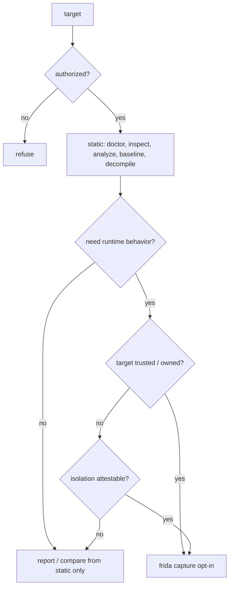

# ghidra — headless reverse engineering

Single skill for authorized reverse engineering of native binaries through
Ghidra in headless mode. It reimplements, clean-room, the useful capabilities
of the upstream `headless-ghidra` skill family (15 catalog entries) behind one
friendly CLI with structured JSON artifacts. See
`references/upstream-matrix.md` and `references/provenance.md`.

## Authorization & safety (read first)

- Only analyze binaries you are **authorized** to reverse engineer. Refuse
  requests that lack authorization or target software you may not analyze.
- **Static analysis never executes the target.** Import, auto-analysis,
  baseline export, decompilation, and inspection all treat the binary as inert
  data.
- **Dynamic execution is opt-in.** Frida capture/trace, project rebuild, and
  any harness are dynamic operations. Untrusted or suspect samples require the
  native isolation controls in `references/security.md` (ephemeral VM or
  network-blocked container, read-only mounts, non-root user, dropped
  capabilities, seccomp, CPU/RAM/PID/disk quotas, hard timeout, manifest, and
  teardown). If those controls cannot be attested, stay static.
- `ghidra doctor` reports `dynamic_ready: false` when any required isolation
  control is missing. Never fabricate a trace or claim a capability the CLI
  does not implement.
- For `.node` addons and V8/JS-adjacent inputs, `ghidra` analyzes the native
  side and hands off bytecode/JS to `bytenode-v8-re` and `js-ts-deobfuscation`.

## Static vs. dynamic decision



Prefer static. Only escalate to dynamic when runtime behavior is required *and*
the safety tier is satisfied.

## Quick start

```sh
ghidra doctor --format json                    # verify environment first
ghidra init ./target --target demo --scope full
ghidra analyze --target demo                   # import + auto-analyze + baseline
ghidra list functions --target demo
ghidra decompile --target demo --function main
ghidra validate --target demo
```

All artifacts land under `<workspace>/artifacts/<target-id>/`. Nothing is
written inside the skill directory. Every command emits a JSON envelope
`{ "status", "message", "data", "artifacts" }` on stdout; logs go to stderr.
Exit codes: `0` ok, `1` operational failure, `2` usage/validation, `32` lock
timeout.

## Workflow

```
doctor  ->  init  ->  analyze  ->  inspect / list / show  ->  decompile  ->  compare / report
```

1. **doctor** — verify Ghidra/JDK/Python/binutils/Frida/isolation. This is the
   recovery surface when anything is missing.
2. **init** — create the target workspace, hash the binary, inspect its format,
   set scope (`--scope full|symbols|addresses`, `--entry`).
3. **analyze** — import into Ghidra and auto-analyze via `analyzeHeadless`, then
   export the seven baselines.
4. **inspect / list / show** — read structured baselines (functions, callgraph,
   types, vtables, constants, strings, imports) without re-running Ghidra.
5. **metadata** — record and apply renames/signatures/types, then re-export to
   verify.
6. **decompile** — single function or batch; batch preserves partial successes.
7. **compare / report** — separate observed / inferred / unresolved; preserve
   static-vs-dynamic conflict; emit provenance.

Public states: `initialized | analyzed | enriched | decompiled | validated |
failed`. `validate` computes gates (`intake`, `baseline`, `evidence`,
`metadata`, `decompilation`) from artifacts; gates not required by the requested
flow are `not_applicable`, not `passed`. Legacy P0-P6 states in imported
artifacts are translated in the report, never reintroduced as aliases.

## Single-function deep analysis

`ghidra function analyze --target ID SELECTOR` runs a strict, non-reorderable
sequence and records per-step evidence in `analysis/functions/<fn-id>/steps.json`:

```
types  ->  constants / strings  ->  vtables  ->  identity / signature  ->  decompile
```

No step may be skipped or reordered. Ambiguous selectors are rejected before any
work runs.

## Callgraph vs. xrefs (known limitation)

`ghidra list callgraph --callers|--callees [--transitive]` covers **direct call
edges only**. General cross-references (xrefs) are **not** implemented; a future
xrefs capability requires a separate change. This is why `list-callgraph` is
`shipped-partial`.

## Frida (optional, opt-in)

`ghidra frida {doctor,capture,trace,compare,import-evidence}` is manifest-driven
and CLI/headless. Capture/trace require explicit authorization and, for
untrusted targets, the isolation controls in `references/security.md`. When
Frida is absent, commands return `external-required` (exit 2) with actionable
install instructions (`python -m pip install frida-tools`), venv guidance for
externally-managed Python, the official link, and a Linux `ptrace_scope` note.
Never fabricate traces. See `references/frida.md`.

## Scripts

`ghidra script {scaffold,lint,run}`. Java is the guaranteed default. Python
scripts require `doctor`-verified PyGhidra. Scripts live only under
`<skill>/scripts/ghidra/` or `<workspace>/artifacts/<id>/scripts/`;
symlink/path-traversal is rejected and output escaping the allowlist fails. See
`references/script-authoring.md`.

## Artifacts

Canonical `schema_version: 1`, JSON only. Key paths under
`artifacts/<target-id>/`: `state.json`, `intake/inspection.json`,
`baseline/{functions,callgraph,types,vtables,constants,strings,imports}.json`,
`evidence/third-party.json`, `metadata/{renames,signatures,types}.json`,
`decompilation/functions/<fn-id>/{source.c,record.json,analysis.json}`,
`decompilation/batches/<run-id>.json`,
`runtime/captures/<run-id>/{manifest.json,events.jsonl}`,
`reports/<run-id>/{report.md,report.json}`, `gates/latest.json`,
`execution-log.jsonl`. Writes are atomic; each target uses an exclusive lock.
Full schemas in `references/artifact-contract.md`.

## Capabilities

<!-- capabilities:start -->
| Capability | Status | CLI | Safety tier |
|---|---|---|---|
| doctor-environment | shipped | `ghidra doctor` | static-read |
| workspace-init | shipped | `ghidra init` | static-read |
| config-scope | shipped | `ghidra config scope show`; `ghidra config scope set`; `ghidra config scope add`; `ghidra config scope remove` | static-read |
| inspect-binary | shipped | `ghidra inspect` | static-read |
| inspect-archive | shipped-partial | `ghidra inspect` | static-read |
| analyze-import | external-required | `ghidra analyze` | static-ghidra |
| baseline-export | external-required | `ghidra analyze` | static-ghidra |
| list-functions | shipped | `ghidra list functions` | static-read |
| list-callgraph | shipped-partial | `ghidra list callgraph` | static-read |
| list-types | shipped | `ghidra list types` | static-read |
| list-vtables | shipped | `ghidra list vtables` | static-read |
| list-constants | shipped | `ghidra list constants` | static-read |
| list-strings | shipped | `ghidra list strings` | static-read |
| list-imports | shipped | `ghidra list imports` | static-read |
| show-function | shipped | `ghidra show function` | static-read |
| evidence-third-party | shipped | `ghidra evidence third-party` | static-read |
| metadata-record | shipped | `ghidra metadata rename`; `ghidra metadata signature`; `ghidra metadata types` | static-read |
| metadata-apply | external-required | `ghidra metadata apply` | static-ghidra |
| decompile-function | external-required | `ghidra decompile` | static-ghidra |
| decompile-batch | external-required | `ghidra decompile` | static-ghidra |
| function-analyze | external-required | `ghidra function analyze` | static-ghidra |
| compare-progressive | shipped | `ghidra compare` | static-read |
| frida-doctor | shipped | `ghidra frida doctor` | static-read |
| frida-capture | external-required | `ghidra frida capture`; `ghidra frida trace` | dynamic-owned |
| frida-import-evidence | shipped | `ghidra frida import-evidence` | static-read |
| frida-compare | shipped | `ghidra frida compare` | static-read |
| script-scaffold | shipped | `ghidra script scaffold` | static-read |
| script-lint | shipped | `ghidra script lint` | static-read |
| script-run-java | external-required | `ghidra script run` | static-ghidra |
| script-run-python | external-required | `ghidra script run` | static-ghidra |
| validate-gates | shipped | `ghidra validate` | static-read |
| report-provenance | shipped | `ghidra report` | static-read |
| improve-review | shipped | `ghidra improve review` | static-read |
<!-- capabilities:end -->

`shipped` = entrypoint + passing test. `shipped-partial` = works with a stated
limitation. `external-required` = needs Ghidra/JDK/Frida/PyGhidra; `doctor`
verifies and guides installation. Source of truth: `capabilities.json`.

## References

- `references/workflow.md` — intake through decompile iterations.
- `references/cli.md` — commands, flags, examples, error codes.
- `references/artifact-contract.md` — schemas and paths.
- `references/installation.md` — per-OS install matrix (Ghidra/JDK, Python/venv/
  PyGhidra, binutils/compiler, Frida, isolation).
- `references/frida.md` — dynamic capture, opt-in policy, isolation.
- `references/script-authoring.md` — Java/Python scripts, lint rules, allowlist.
- `references/evidence-and-third-party.md` — third-party identification, pristine
  sources, observed/inferred/unresolved separation.
- `references/security.md` — threat model and native isolation controls.
- `references/upstream-matrix.md` — 15/15 capability provenance.
- `references/provenance.md` — clean-room + license contract.
